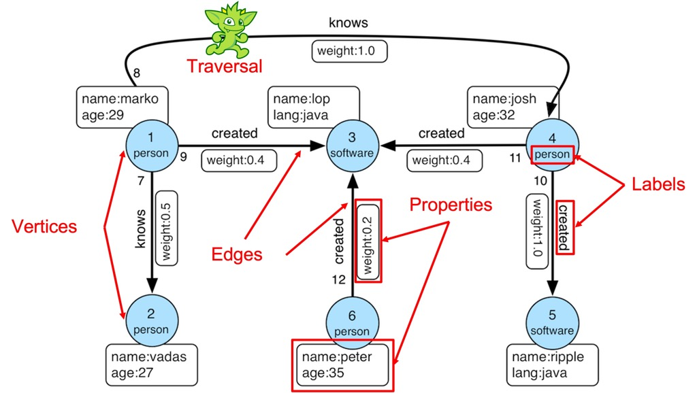

## Introduction

This repository demonstrates how to use Amazon Neptune.

## What is a Graph Database

Graph databases are **optimized for storing and querying relationships** between entities. Unlike relational or NoSQL databases, graph databases excel in scenarios where relationships are complex and performance is critical.

In graph databases:

- **Vertices (nodes)** represent entities.
- **Edges** define relationships between vertices.
- Both vertices and edges can have properties (key-value pairs). A graph with labeled vertices and edges is called a **property graph**.



## Introduction to Amazon Neptune

Amazon Neptune is a **fully managed graph database service** capable of querying billions of relationships in milliseconds. It offers high availability, durability, and low latency.

### Key Features

- Cluster Scalability: Up to **15 read replicas**.
- Automatic Scaling: Storage expands automatically up to **64 TiB**.
- Data Redundancy: Maintains **6 copies across 3 availability zones**.

### Transactions in Neptune

Neptune manages read-only and mutation queries using distinct transaction isolation levels. [Learn more in the documentation](https://docs.aws.amazon.com/neptune/latest/userguide/transactions-neptune.html).

#### Read-Only Queries

For read-only queries, Neptune uses **snapshot isolation** within [MultiVersion Concurrency Control (MVCC)](https://en.wikipedia.org/wiki/Multiversion_concurrency_control). This ensures that **dirty reads**, **non-repeatable reads**, and **phantom reads** are prevented by using a snapshot taken at the start of the transaction.

#### Mutation Queries

For mutation queries, Neptune uses **READ COMMITTED isolation** to prevent dirty reads. Additionally, **Neptune locks the record set being read**, ensuring that **non-repeatable reads** and **phantom reads** are avoided.

### Querying with Gremlin

Amazon Neptune supports querying with **Gremlin**, an open-source graph traversal language. Developers can also use [Graph Notebook](https://github.com/aws/graph-notebook) for querying and visualization.

## Traversal Examples

### Sample Graph Data

This example uses a graph where vertices have an **age property** and edges define a **weight property**.


Use the following command to load the sample data provided above. The [`%%gremlin`](https://docs.aws.amazon.com/neptune/latest/userguide/notebooks-magics.html#notebooks-cell-magics-gremlin) is a Jupyter Notebook magic command specifically designed for use with Neptune Workbench.

```java
%%gremlin
// Drop existing data
g.V().drop()
```

```java
%%gremlin
// Add Vertices
g.addV('person').property(id, 'A').property('age', 30)
 .addV('person').property(id, 'B').property('age', 25)
 .addV('person').property(id, 'C').property('age', 35)
 .addV('person').property(id, 'D').property('age', 20)
 .addV('person').property(id, 'E').property('age', 18)
 .addV('person').property(id, 'F').property('age', 25)
 .addV('person').property(id, 'G').property('age', 10)
 .addV('person').property(id, 'H').property('age', 15)
```

```java
%%gremlin
// Add Edges
g.V('A').addE('know').to(g.V('B')).property('weight', 1.0)
 .V('A').addE('know').to(g.V('C')).property('weight', 0.9)
 .V('A').addE('know').to(g.V('H')).property('weight', 0.5)
 .V('B').addE('know').to(g.V('D')).property('weight', 0.8)
 .V('B').addE('know').to(g.V('E')).property('weight', 0.4)
 .V('C').addE('know').to(g.V('F')).property('weight', 0.5)
 .V('C').addE('know').to(g.V('G')).property('weight', 0.6)
 .V('D').addE('know').to(g.V('E')).property('weight', 0.7)
 .V('H').addE('know').to(g.V('E')).property('weight', 1.0)
 .V('H').addE('know').to(g.V('G')).property('weight', 1.0)
```

### Example 1: Retrieving All Vertices

```java
%%gremlin
// Extract Vertices
g.V()
 .project('id', 'properties') // Projection
 .by(id()).by(valueMap()) // valueMap returns properties of vertices.
```

Result:

| Row | Data |
| --- | ---- |
| 1 | `{'id': 'A', 'properties': {'age': [30]}}` |
| 2 | `{'id': 'B', 'properties': {'age': [25]}}` |
| 3 | `{'id': 'C', 'properties': {'age': [35]}}` |
| 4 | `{'id': 'D', 'properties': {'age': [20]}}` |
| 5 | `{'id': 'E', 'properties': {'age': [18]}}` |
| 6 | `{'id': 'F', 'properties': {'age': [25]}}` |
| 7 | `{'id': 'G', 'properties': {'age': [10]}}` |
| 8 | `{'id': 'H', 'properties': {'age': [15]}}` |

### Example 2: Traversing Connections

Retrieve all persons older than 25 and connected to 'A' within two levels:

```java
%%gremlin
// Extract persons (entities) which are older than 25 years old and connected from A up to 2nd.
g.V('A')
 .repeat(outE().inV()).times(2).emit() // Repeat traversal of adjacent vertices twice
 .has('age', gte(25)) // Greater than or equal 25 years old
 .project('id', 'age')
 .by(id()).by(values('age'))
```

Result:

| Row | Data |
| --- | ---- |
| 1 | `{'id': 'B', 'age': 25}` |
| 2 | `{'id': 'C', 'age': 35}` |
| 3 | `{'id': 'F', 'age': 25}` |


### Example 3: Filtering by Weight

Find persons where the **multiplied weight exceeds 0.5**:

```java
%%gremlin
// Start traversal at A which extracts vertices that have a multiplied weight value greater than 0.5
g.withSack(1.0f).V('A') // Sack can be used to store temporary data
 // Multiply a weight value of an out-directed edge by a sack value, and traverse all in-directed vertices
 .repeat(outE().sack(mult).by('weight').inV().simplePath()).emit()
 .where(sack().is(gt(0.5))) // A sack value greater than 0.5
 .dedup() // deduplication
 .project('id', 'weight')
 .by(id).by(sack())
```

Result:

| Row | Data |
| --- | ---- |
| 1 | `{'id': 'B', 'weight': 1.0}` |
| 2 | `{'id': 'C', 'weight': 0.9}` |
| 3 | `{'id': 'D', 'weight': 0.8}` |
| 4 | `{'id': 'G', 'weight': 0.54}` |
| 5 | `{'id': 'E', 'weight': 0.5599…}` |


### Visualizing Graphs

Neptune Workbench offers tools to visualize graphs interactively. Refer to the official documentation for more details: [Neptune Visualization](https://docs.aws.amazon.com/neptune/latest/userguide/notebooks-visualization.html).

To visualize the graph, execute the following command:

```java
%%gremlin -d T.id -de weight
// -d specifies the vertex property to display
// -de specifies the edge property to display

// Execute traversal from example 3
g.withSack(1.0f).V('A') // Sack is used to store temporary data
 .repeat(outE().sack(mult).by('weight').inV().simplePath()).emit() // Traverse with edge weight
 .where(sack().is(gt(0.5))) // Filter paths where the sack value > 0.5
 .dedup() // Remove duplicate paths
 .path() // Extract path data
 .by(elementMap()) // Display properties of vertices and edges
```

Example Output:

| Row | Data |
| --- | ---- |
| 1 | `path[{<T.id: 1>: 'A', <T.label: 4>: 'person', 'age': 30}, {<T.id: 1>: '8ebe47fa-901b-c6d3-a11f-0a9bf0ce8aa2', <T.label: 4>: 'know', <Direction.IN: 2>: {<T.id: 1>: 'B', <T.label: 4>: 'person'}, <Direction.OUT: 3>: {<T.id: 1>: 'A', <T.label: 4>: 'person'}, 'weight': 1.0}, {<T.id: 1>: 'B', <T.label: 4>: 'person', 'age': 25}]` |
| 2 | `path[{<T.id: 1>: 'A', <T.label: 4>: 'person', 'age': 30}, {<T.id: 1>: '7abe47fa-901c-c394-4bed-6dce7defa3f9', <T.label: 4>: 'know', <Direction.IN: 2>: {<T.id: 1>: 'C', <T.label: 4>: 'person'}, <Direction.OUT: 3>: {<T.id: 1>: 'A', <T.label: 4>: 'person'}, 'weight': 0.9}, {<T.id: 1>: 'C', <T.label: 4>: 'person', 'age': 35}]` |

Once executed, navigate to the `Graph` tab in Neptune Workbench to visualize the result. The interface supports drag, zoom-in, and zoom-out operations, allowing for intuitive graph exploration.


## Conclusion

Graph databases provide significant advantages in handling relationships, and Amazon Neptune makes deploying such databases seamless on AWS. With Gremlin, you can efficiently traverse and analyze complex data relationships.

If you're looking to explore graph databases, Amazon Neptune is an excellent starting point.

Happy Coding! 🚀

---

## Appendix 1: Representing Tree Structures in Relational Databases (RDB)

Tree structures can be modeled in relational databases (RDB) using various approaches. In some scenarios, graph databases may not be necessary. However, it is important to note that the **Naive Tree model** is often suboptimal for many cases, as discussed in ["SQL Antipatterns"](https://learning.oreilly.com/library/view/sql-antipatterns/9781680500073/).

| Model              | Description                 | Pros                                               | Cons                                                                                                  |
|--------------------|-----------------------------|---------------------------------------------------|-------------------------------------------------------------------------------------------------------|
| **Naive Tree**     | `t1.id = t2.parent_id`      | <ul><li>Simple implementation (Adjacency List)</li></ul>          | <ul><li>Difficult to extract non-adjacent nodes</li><li>Complex SQL</li><li>Low performance</li></ul> |
| **Path Enumeration** | `path LIKE '1/2%'`         | <ul><li>Simplifies extracting non-adjacent nodes</li></ul>        | <ul><li>Complex INSERT/UPDATE/DELETE operations</li><li>Limited by column max length</li></ul>        |
| **Nested Sets**    | `Left > 1 AND Right < 6`    | <ul><li>Efficient for querying non-adjacent nodes</li></ul>       | <ul><li>Complex INSERT/UPDATE operations</li><li>Limited by column max length</li><li>Non-intuitive structure</li></ul> |
| **Closure Table**  | Separate table for the tree | <ul><li>Efficient for querying all nodes</li><li>Handles INSERT/UPDATE/DELETE easily</li></ul> | <ul><li>Data can grow significantly in size</li><li>INSERT/UPDATE/DELETE can have low performance</li></ul> |

Each approach has its advantages and limitations, making the choice dependent on the specific requirements of your application.

## Appendix 2: Transactions

### Dirty Read

When Tx1 updates the row, Tx2 reads the row, and Tx1 fails or rollbacks, Tx2 **reads data which has not been reflected.**


### Non-repeatable Read

When Tx1 reads the row, Tx2 updates or deletes the row and commits, and Tx1 reads the row again, Tx1 **reads committed data different from the previous one.**


### Phantom Read

When Tx1 reads the records, Tx2 inserts or deletes some rows and commits, and Tx1 reads the rows again, Tx1 **reads the rows different from the previous ones.**


### Isolation Levels

| Level             | Dirty Read  | Non-repeatable Read | Phantom Read  |
|-------------------|-------------|---------------------|---------------|
| **READ UNCOMMITTED** | Possible    | Possible            | Possible       |
| **READ COMMITTED**   | Not possible | Possible            | Possible       |
| **REPEATABLE READ**  | Not possible | Not possible        | Possible       |
| **SERIALIZABLE**     | Not possible | Not possible        | Not possible   |

## Appendix 3: Querying with Relational Databases (RDB)

When storing data in an RDB, querying relationships can become increasingly complex. **SQL queries often grow in complexity, and representing interconnected data within a row-column structure is unintuitive.**


